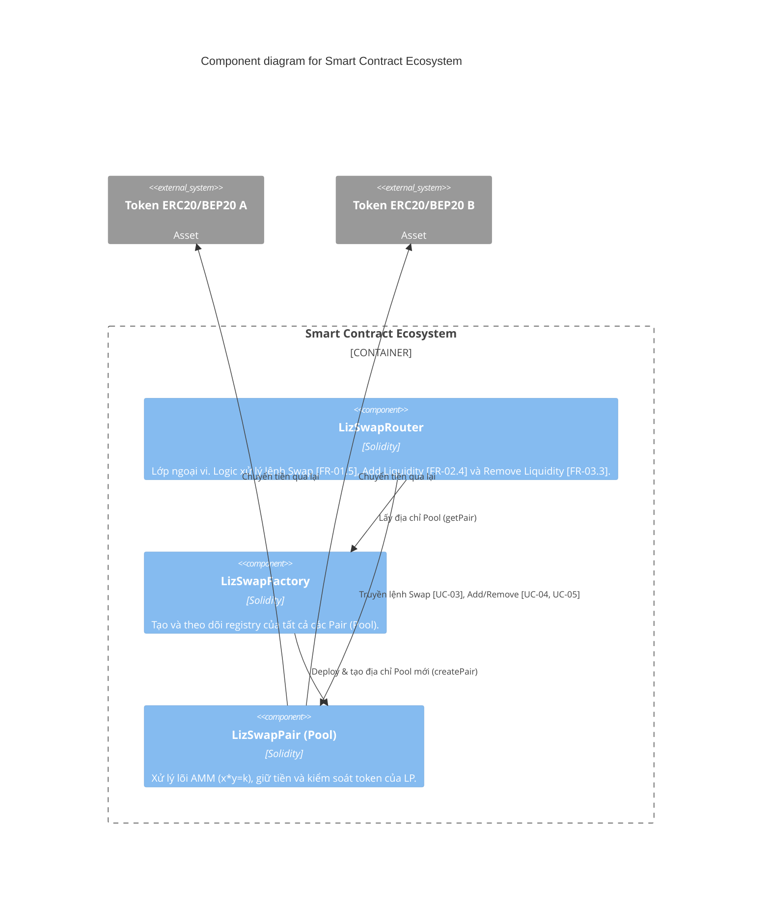
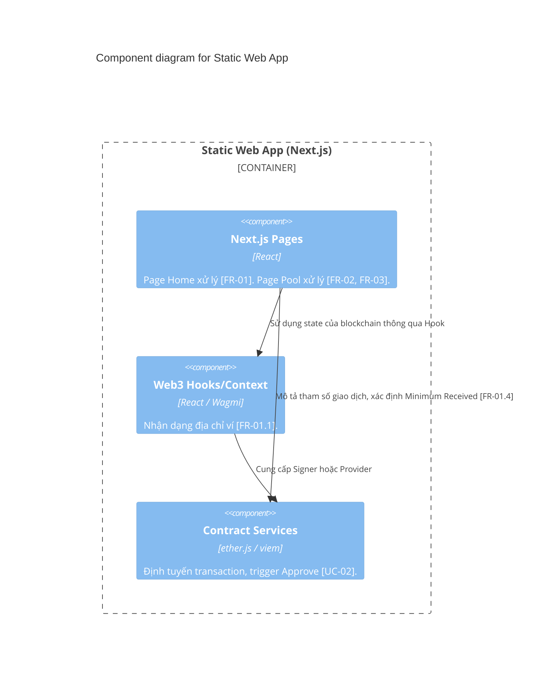

# 3. Component (Cấp 3 - Thành Phần)

> **Phiên bản:** v1 | **Ngày tạo:** 9 tháng 4 năm 2026 | **Tác giả:** Khanh

Tập trung đi sâu vào hai Container cốt lõi: **Static Web App** (Frontend) và **Smart Contract Ecosystem**. Ở đây sẽ diễn giải rõ cách các luồng chức năng (FR) được xử lý bởi component nào.

## 3.1. Phân rã Smart Contract Ecosystem
Lõi AMM dựa trên kiến trúc của Uniswap V2.

## 3.2. Phân rã Static Web App
Các khối giao diện đảm bảo tính linh hoạt [NFR-03].

