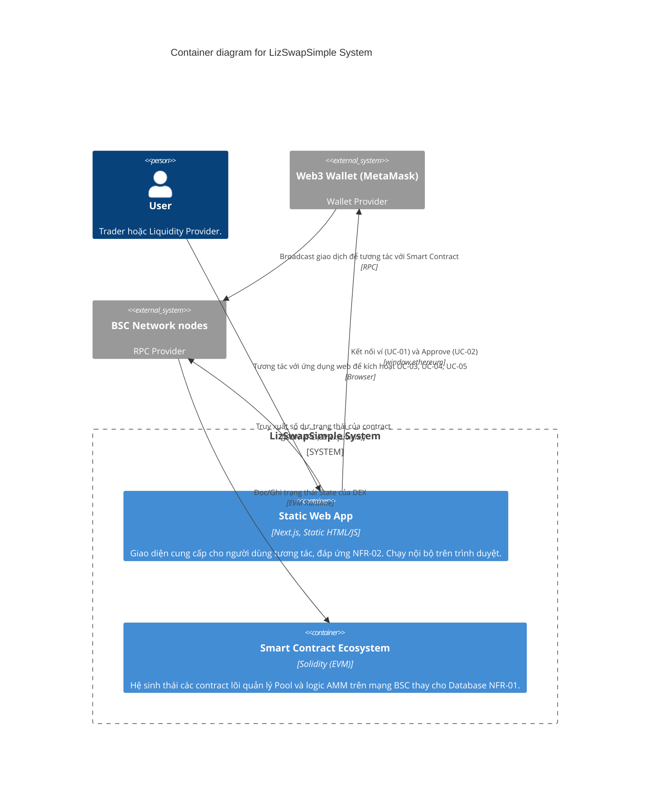

# 2. Container (Cấp 2 - Khối Chứa)

> **Phiên bản:** v1 | **Ngày tạo:** 9 tháng 4 năm 2026 | **Tác giả:** Khanh

Mổ xẻ "LizSwapSimple System" thành các vùng thực thi (Container) độc lập. Do dự án yêu cầu [NFR-01] (Không Backend Database) và [NFR-02] (Frontend Tĩnh Nhanh Chóng), kiến trúc ở cấp độ này rất tinh gọn.

