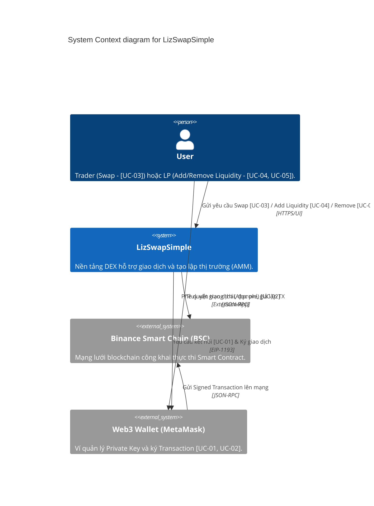

# 1. System Context (Cấp 1 - Ngữ Cảnh Hệ Thống)

> **Phiên bản:** v1 | **Ngày tạo:** 9 tháng 4 năm 2026 | **Tác giả:** Khanh

Mô tả bức tranh toàn cảnh về việc ai sẽ sử dụng hệ thống và hệ thống tương tác với các yếu tố bên ngoài nào, đảm bảo đáp ứng các Use Case cốt lõi trong SRS.

