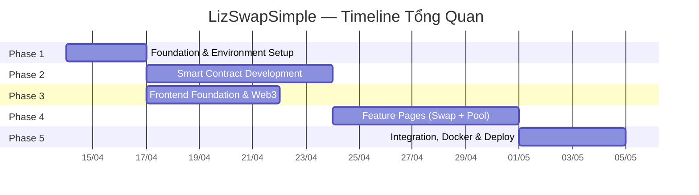

# 📋 Bảng Tóm Tắt Dự Án (Master Plan) — LizSwapSimple DEX

> **Phiên bản:** v1 | **Ngày tạo:** 12 tháng 4 năm 2026 | **Tác giả:** Khanh

---

## 👥 Đội ngũ

| Tên | Vai trò | Chuyên môn |
|---|---|---|
| **Khanh** | Trưởng dự án | Solidity, Hardhat, Next.js, Docker, DevOps |
| **Hộp** | Frontend Dev | Next.js, shadcn/ui, Tailwind CSS, ethers.js |
| **Huy** | Frontend Dev | Next.js, shadcn/ui, Tailwind CSS, ethers.js |

---

## 🗺️ Tổng Quan Các Phase



| Phase | Tên | Mô tả | Người chính |
|:---:|---|---|---|
| **1** | Foundation & Environment Setup | Khởi tạo monorepo, Hardhat, Next.js, Docker, `.env`, cấu hình chung | Khanh (chủ trì), Hộp |
| **2** | Smart Contract Development | Viết, test toàn bộ hệ sinh thái Smart Contract (Core + Periphery) | **Khanh** (chuyên trách) |
| **3** | Frontend Foundation & Web3 Integration | Design System, Layout, Navbar, Hook Web3, Contract Services | Hộp, Huy |
| **4** | Feature Pages Implementation | Trang Swap `[FR-01]`, Trang Pool `[FR-02, FR-03]`, Modal/Toast TX | Hộp, Huy |
| **5** | Integration Testing, Docker & Deploy | E2E testing, đóng gói Docker, deploy BSC Testnet | Khanh (chủ trì), Hộp, Huy |

> [!IMPORTANT]
> **Phase 2** (Smart Contract) và **Phase 3** (Frontend Foundation) chạy **song song** được vì Frontend chỉ cần ABI output ở Phase 4. Khanh làm SC trong khi Hộp + Huy dựng nền Frontend.

---

## ═══════════════════════════════════════════
## PHASE 1 — Foundation & Environment Setup
## ═══════════════════════════════════════════

> **Mục tiêu:** Khởi tạo Monorepo với Hardhat + Next.js, cấu hình build/deploy, Docker, biến môi trường. Đảm bảo mọi thành viên có thể `npm install` và bắt đầu code ngay.

| WBS ID | Tên Task | Mô tả ngắn gọn | Mã Yêu cầu | Người đảm nhận | Task phụ thuộc | Link |
|---|---|---|---|---|---|---|
| **1.1** | Khởi tạo Monorepo và Package Configuration | Setup `package.json` với script dev/build, cài dependencies Blockchain/Frontend, setup `tsconfig.json`. | `[NFR-02]`, `[NFR-03]` | **Khanh** | Không có | [Chi tiết](tasks/task-1.1.md) |
| **1.2** | Cấu hình Hardhat Environment | Cấu hình Solidity `0.8.20+`, optimizer, và định nghĩa networks (localhost, testnet) từ biến môi trường. | `[NFR-03]` (Configurable), Tech Stack §1 | **Khanh** | Task 1.1 | [Chi tiết](tasks/task-1.2.md) |
| **1.3** | Tạo Template Biến Môi Trường | Tạo `.env.example` chứa cấu hình RPC, Private Key, Factory/Router. Cập nhật `.gitignore`. | `[NFR-03]` (Configurable) | **Khanh** | Task 1.2 | [Chi tiết](tasks/task-1.3.md) |
| **1.4** | Khởi tạo Next.js App Structure | Tạo Next.js App Router (static export), định hình cấu trúc cây thư mục UI/API theo srs, config Tailwind baseline. | `[NFR-02]` (Frontend Tĩnh), project-structure.md §2 | **Hộp** | Task 1.1 | [Chi tiết](tasks/task-1.4.md) |
| **1.5** | Cấu hình Docker & Docker Compose | Viết `Dockerfile` auto multi-stage build và `docker-compose.yml` để dễ dàng run frontend ở port 3000. | `[NFR-02]` (Deploy dễ), project-structure.md §3 | **Khanh** | Task 1.4 | [Chi tiết](tasks/task-1.5.md) |
| **1.6** | Khởi tạo shadcn/ui và Tailwind Design Token | Tích hợp thư viện UI shadcn, áp dụng font JetBrains Mono và design color tokens vào CSS toàn cục. | `[NFR-02]`, frontend-design.md §1, §5 | **Hộp** | Task 1.4 | [Chi tiết](tasks/task-1.6.md) |

## ═══════════════════════════════════════════
## PHASE 2 — Smart Contract Development
## ═══════════════════════════════════════════

> **Mục tiêu:** Viết, biên dịch và test toàn bộ hệ sinh thái Smart Contract lõi (Core) và ngoại vi (Periphery) theo C4 Component Diagram. Phase này do **Khanh** chuyên trách hoàn toàn.

| WBS ID | Tên Task | Mô tả ngắn gọn | Mã Yêu cầu | Người đảm nhận | Task phụ thuộc | Link |
|---|---|---|---|---|---|---|
| **2.1** | Contract Interfaces | Định nghĩa các Interface `ILizSwapFactory.sol`, `ILizSwapPair.sol`, `ILizSwapRouter.sol`, `ILizSwapERC20.sol` với các function signatures và events. | C4-Component (toàn bộ SC boundary) | **Khanh** | Task 1.2 | [Chi tiết](tasks/task-2.1.md) |
| **2.2** | LizSwapERC20.sol (LP Token Base) | Contract LP Token. Kế thừa `ERC20` OpenZeppelin, định nghĩa `_mint` và `_burn` cho Pair sử dụng. | `[FR-02.4]` (Mint LP Token), C3 - Pair component, techstack.md §1 | **Khanh** | Task 2.1 | [Chi tiết](tasks/task-2.2.md) |
| **2.3** | LizSwapFactory.sol | Contract Factory quản lý registry các cặp token `getPair` và cung cấp hàm `createPair` để deploy `LizSwapPair`. | C3 - Factory component | **Khanh** | Task 2.2 | [Chi tiết](tasks/task-2.3.md) |
| **2.4** | LizSwapPair.sol (Lõi AMM) | Lõi AMM Pool. Xử lý công thức x*y=k với hàm `mint`, `burn`, `swap`, áp dụng phí 0.3%, có ReentrancyGuard bảo vệ. | `[FR-01.3]` (Công thức x*y=k), `[UC-03]` Swap, `[UC-04]` Add, `[UC-05]` Remove, C3 - Pair | **Khanh** | Task 2.2, Task 2.3 | [Chi tiết](tasks/task-2.4.md) |
| **2.5** | Math Libraries | Các thư viện `Math.sol` (sqrt, min) và `LizSwapLibrary.sol` (tính toán Quote, getAmountOut, getReserves). | `[FR-01.3]` (Công thức tính toán), project-structure.md §1 | **Khanh** | Task 2.3, Task 2.4 | [Chi tiết](tasks/task-2.5.md) |
| **2.6** | LizSwapRouter.sol (Periphery) | User entry point chứa các hàm: `addLiquidity`, `removeLiquidity`, `swapExactTokensForTokens` kèm check slippage / deadline. | `[UC-03]`, `[UC-04]`, `[UC-05]`, `[FR-01.5]`, `[FR-02.4]`, `[FR-03.2]`, C3 - Router | **Khanh** | Task 2.4, Task 2.5 | [Chi tiết](tasks/task-2.6.md) |
| **2.7** | MockERC20 Token | Contract ERC20 giả lập, cung cấp public `mint` để deployer tạo token test trên Local/Testnet. | project-structure.md §1 (mock/) | **Khanh** | Task 1.2 | [Chi tiết](tasks/task-2.7.md) |
| **2.8** | Deployment Script (Hardhat) | Viết script Hardhat Ignition deploy Factory, Router, Mocks và auto xuất `addresses.json` & ABI sang file Frontend. | project-structure.md §1 (ignition/), `[NFR-03]` | **Khanh** | Task 2.6, Task 2.7 | [Chi tiết](tasks/task-2.8.md) |
| **2.9** | Smart Contract Unit Tests | Viết Unit Test cho Factory, Pair, Router đảm bảo logic tạo pool, AMM swap, thanh khoản hoạt động đúng (cover >= 90%). | Toàn bộ UC, FR | **Khanh** | Task 2.6, Task 2.7 | [Chi tiết](tasks/task-2.9.md) |

## ═══════════════════════════════════════════
## PHASE 3 — Frontend Foundation & Web3 Integration
## ═══════════════════════════════════════════

> **Mục tiêu:** Dựng khung giao diện (Layout, Navbar), tích hợp Web3 (kết nối ví MetaMask), và tạo Service layer sẵn sàng gọi Smart Contract. Phase này chạy **song song** với Phase 2.

| WBS ID | Tên Task | Mô tả ngắn gọn | Mã Yêu cầu | Người đảm nhận | Task phụ thuộc | Link |
|---|---|---|---|---|---|---|
| **3.1** | Root Layout & Google Font Integration | Cấu hình Root Layout Next.js, import font JetBrains Mono, setup nền `bg-slate-50` và SEO metadata. | `[NFR-02]`, frontend-design.md §3 (Font JetBrains Mono) | **Hộp** | Task 1.6 | [Chi tiết](tasks/task-3.1.md) |
| **3.2** | Navbar Component | Thiết kế Navbar điều hướng có Logo gradient, link chuyển Swap/Pool, tích hợp nút WalletConnect, hỗ trợ responsive. | `[UC-01]` (Kết nối ví), `[FR-01.1]`, frontend-design.md §2, §4, project-structure.md §2 | **Hộp** | Task 3.1, Task 3.4 | [Chi tiết](tasks/task-3.2.md) |
| **3.3** | useWeb3 Hook (Web3 State Management) | Hook trung tâm kết nối MetaMask (`eth_requestAccounts`), quản lý state Web3 (provider, signer, account, chainId). | `[UC-01]` (Kết nối ví), `[FR-01.1]`, project-structure.md §2 (hooks/useWeb3.ts), C4-Component (Web3 Hooks) | **Huy** | Task 1.4 | [Chi tiết](tasks/task-3.3.md) |
| **3.4** | WalletConnectButton Component | Nút UI hiển thị trạng thái kết nối ví (Loading, Mặc định gradient blue, Đã kết nối show account rút gọn). | `[UC-01]`, `[FR-01.1]`, project-structure.md §2 (components/web3/) | **Huy** | Task 3.3 | [Chi tiết](tasks/task-3.4.md) |
| **3.5** | Contract Service Layer & ABI Integration | Lớp `swapService` abstract logic ethers.js: gọi read/write SC (approve, swap, addLiquidity, getQuotes) bằng ABI xuất từ Phase 2. | `[UC-02]` (Approve), `[UC-03]`, project-structure.md §2 (services/), C4-Component (Contract Services) | **Huy** | Task 2.8 (ABI output), Task 3.3 | [Chi tiết](tasks/task-3.5.md) |
| **3.6** | Cài đặt shadcn/ui Components cơ bản | Cài qua CLI các UI components cốt lõi (button, card, dialog, toast, select, v.v.), kế thừa màu sắc design local. | frontend-design.md §1, §4, techstack.md §2 | **Hộp** | Task 1.6 | [Chi tiết](tasks/task-3.6.md) |

## ═══════════════════════════════════════════
## PHASE 4 — Feature Pages Implementation
## ═══════════════════════════════════════════

> **Mục tiêu:** Xây dựng hai trang chính: **Swap** `[FR-01]` và **Pool** `[FR-02, FR-03]`, bao gồm toàn bộ logic tương tác UI với Smart Contract qua `swapService.ts`.

| WBS ID | Tên Task | Mô tả ngắn gọn | Mã Yêu cầu | Người đảm nhận | Task phụ thuộc | Link |
|---|---|---|---|---|---|---|
| **4.1** | TokenSelector Component | UI chọn token, hiển thị số dư, danh sách load từ `tokenList.json`, hiển thị trong Modal (Dialog). | `[FR-01.2]` (Chọn Token nguồn/đích), `[FR-02.1]` (Chọn cặp Token) | **Hộp** | Task 3.6 | [Chi tiết](tasks/task-4.1.md) |
| **4.2** | Swap Page (Trang Hoán Đổi) | Trang chủ xử lý Swap: form Input/Output tự động quote, check allowance, hiển thị Price Impact, thực thi TX hoán đổi. | `[UC-02]`, `[UC-03]`, `[FR-01]` (tất cả sub-items), C4-Component (Page Home) | **Hộp** | Task 3.2, Task 3.5, Task 3.6, Task 4.1 | [Chi tiết](tasks/task-4.2.md) |
| **4.3** | Pool Page — Add Liquidity Form | Tab thêm thanh khoản, auto-quote số lượng Token B, hiển thị % Share of Pool, check approve 2 chiều, gọi Add Liquidity. | `[UC-02]`, `[UC-04]`, `[FR-02]` (tất cả sub-items), C4-Component (Page Pool) | **Huy** | Task 3.5, Task 4.1 | [Chi tiết](tasks/task-4.3.md) |
| **4.4** | Pool Page — Remove Liquidity & LP Positions | Hiển thị danh sách LP Positions đang hold, form chọn tỉ lệ (%) rút thanh khoản, approve LP Token và thực thi Remove Liquidity. | `[UC-02]`, `[UC-05]`, `[FR-03]` (tất cả sub-items) | **Huy** | Task 3.5, Task 4.3 | [Chi tiết](tasks/task-4.4.md) |
| **4.5** | Transaction Toast/Notification System | Hệ thống Toast Notification thông báo feedback TX (Pending, Success, Error) tự động dismiss sau 8s, màu sắc theo hệ design. | frontend-design.md §4 (Transitions, Loading State), `[FR-01.5]` feedback | **Hộp** | Task 3.6, Task 3.1 | [Chi tiết](tasks/task-4.5.md) |
| **4.6** | Confirmation Dialog (Modal xác nhận) | Các Modal xác nhận (`ConfirmSwapDialog`, `ConfirmLiquidityDialog`) hiển thị tóm tắt thông số cho user review trước khi ký gửi ví. | frontend-design.md §4 (Transitions Modal), `[FR-01.4]` | **Hộp** | Task 3.6, Task 4.2, Task 4.3 | [Chi tiết](tasks/task-4.6.md) |

## ═══════════════════════════════════════════
## PHASE 5 — Integration Testing, Docker & Deployment
## ═══════════════════════════════════════════

> **Mục tiêu:** Kiểm thử tích hợp end-to-end, đóng gói Docker hoàn chỉnh, deploy Smart Contract lên BSC Testnet, kiểm tra toàn bộ luồng UC trên testnet thật.

| WBS ID | Tên Task | Mô tả ngắn gọn | Mã Yêu cầu | Người đảm nhận | Task phụ thuộc | Link |
|---|---|---|---|---|---|---|
| **5.1** | End-to-End Integration Test (Local) | Thử nghiệm hệ thống toàn vẹn, đi luồng UC-01 → UC-05 (swap, liquidity) và các case lỗi bằng local Hardhat. | Tất cả `[UC-01]` → `[UC-05]` | **Khanh** (chủ trì), Hộp, Huy | Tất cả Phase 2, 3, 4 | [Chi tiết](tasks/task-5.1.md) |
| **5.2** | Docker Production Build & Verify | Chạy `docker compose up --build` để verify Dockerfile xuất web tĩnh, kiểm tra dung lượng container nhẹ (<100MB). | `[NFR-02]` | **Khanh** | Task 5.1 | [Chi tiết](tasks/task-5.2.md) |
| **5.3** | Deploy Smart Contract lên BSC Testnet | Config biến môi trường, deploy Factory/Router lên BSC Testnet (chainId 97), nâng cấp UI trỏ tới SC mạng thật. | `[NFR-03]` (Configurable testnet → mainnet), techstack.md §3 | **Khanh** | Task 2.9 | [Chi tiết](tasks/task-5.3.md) |
| **5.4** | E2E Test trên BSC Testnet | Đổi ví sang BSC Testnet, nhận MockToken qua faucet (nếu cần), đánh giá lại các usecases thực tế và check lại trên BSCScan. | Tất cả UC, FR trên môi trường testnet thật | **Hộp**, **Huy** | Task 5.3 | [Chi tiết](tasks/task-5.4.md) |
| **5.5** | Final Documentation & README | Hoàn thiện file `README.md` để dev mới có thể cài đặt dễ dàng (HD chạy local, testnet, docker, link document dự án). | Project documentation | **Khanh** | Task 5.4 | [Chi tiết](tasks/task-5.5.md) |

## ═══════════════════════════════════════════
## 📝 DANH SÁCH TO-DO CÁ NHÂN
## ═══════════════════════════════════════════

---

### 🔷 TODO — Khanh (Trưởng dự án / Smart Contract / DevOps)

| # | WBS ID | Task | Phase | Task phụ thuộc |
|:---:|:---:|---|:---:|---|
| 1 | 1.1 | Khởi tạo Monorepo & Package Config | P1 | — |
| 2 | 1.2 | Cấu hình Hardhat Environment | P1 | 1.1 |
| 3 | 1.3 | Tạo Template Biến Môi Trường (.env) | P1 | 1.2 |
| 4 | 1.5 | Cấu hình Docker & Docker Compose | P1 | 1.4 (Hộp) |
| 5 | 2.1 | Contract Interfaces (IFactory, IPair, IRouter, IERC20) | P2 | 1.2 |
| 6 | 2.2 | LizSwapERC20.sol (LP Token Base) | P2 | 2.1 |
| 7 | 2.3 | LizSwapFactory.sol | P2 | 2.2 |
| 8 | 2.4 | LizSwapPair.sol (Lõi AMM x*y=k) | P2 | 2.2, 2.3 |
| 9 | 2.5 | Math Libraries (LizSwapLibrary, Math) | P2 | 2.3, 2.4 |
| 10 | 2.6 | LizSwapRouter.sol (Periphery Entry Point) | P2 | 2.4, 2.5 |
| 11 | 2.7 | MockERC20 Token | P2 | 1.2 |
| 12 | 2.8 | Deployment Script (Hardhat Ignition) + Export ABI | P2 | 2.6, 2.7 |
| 13 | 2.9 | Smart Contract Unit Tests (Factory, Pair, Router) | P2 | 2.6, 2.7 |
| 14 | 5.1 | E2E Integration Test — Local (chủ trì) | P5 | All P2, P3, P4 |
| 15 | 5.2 | Docker Production Build & Verify | P5 | 5.1 |
| 16 | 5.3 | Deploy Smart Contract lên BSC Testnet | P5 | 2.9 |
| 17 | 5.5 | Final Documentation & README | P5 | 5.4 |

---

### 🟢 TODO — Hộp (Frontend Dev — UI/Layout/Swap)

| # | WBS ID | Task | Phase | Task phụ thuộc |
|:---:|:---:|---|:---:|---|
| 1 | 1.4 | Khởi tạo Next.js App Structure | P1 | 1.1 (Khanh) |
| 2 | 1.6 | Khởi tạo shadcn/ui & Tailwind Design Token | P1 | 1.4 |
| 3 | 3.1 | Root Layout & Google Font Integration | P3 | 1.6 |
| 4 | 3.2 | Navbar Component | P3 | 3.1, 3.4 (Huy) |
| 5 | 3.6 | Cài đặt shadcn/ui Components cơ bản | P3 | 1.6 |
| 6 | 4.1 | TokenSelector Component | P4 | 3.6 |
| 7 | 4.2 | **Swap Page (Trang Home chính)** | P4 | 3.2, 3.5 (Huy), 3.6, 4.1 |
| 8 | 4.5 | Transaction Toast/Notification System | P4 | 3.6, 3.1 |
| 9 | 4.6 | Confirmation Dialogs (Swap + Liquidity) | P4 | 3.6, 4.2, 4.3 (Huy) |
| 10 | 5.1 | E2E Integration Test — Local (hỗ trợ) | P5 | All |
| 11 | 5.4 | E2E Test trên BSC Testnet | P5 | 5.3 (Khanh) |

---

### 🟠 TODO — Huy (Frontend Dev — Web3/Pool/Services)

| # | WBS ID | Task | Phase | Task phụ thuộc |
|:---:|:---:|---|:---:|---|
| 1 | 3.3 | useWeb3 Hook (Web3 State Management) | P3 | 1.4 (Hộp) |
| 2 | 3.4 | WalletConnectButton Component | P3 | 3.3 |
| 3 | 3.5 | Contract Service Layer & ABI Integration | P3 | 2.8 (Khanh ABI), 3.3 |
| 4 | 4.3 | **Pool Page — Add Liquidity Form** | P4 | 3.5, 4.1 (Hộp) |
| 5 | 4.4 | **Pool Page — Remove Liquidity & LP Positions** | P4 | 3.5, 4.3 |
| 6 | 5.1 | E2E Integration Test — Local (hỗ trợ) | P5 | All |
| 7 | 5.4 | E2E Test trên BSC Testnet | P5 | 5.3 (Khanh) |

---

## 🔗 Sơ Đồ Phụ Thuộc Tổng Thể

```mermaid
flowchart TD
    subgraph "Phase 1 — Foundation"
        T1_1["1.1 Monorepo Init<br/>(Khanh)"]
        T1_2["1.2 Hardhat Config<br/>(Khanh)"]
        T1_3["1.3 .env Template<br/>(Khanh)"]
        T1_4["1.4 Next.js App<br/>(Hộp)"]
        T1_5["1.5 Docker<br/>(Khanh)"]
        T1_6["1.6 shadcn + Tailwind<br/>(Hộp)"]
    end

    subgraph "Phase 2 — Smart Contracts"
        T2_1["2.1 Interfaces<br/>(Khanh)"]
        T2_2["2.2 LizSwapERC20<br/>(Khanh)"]
        T2_3["2.3 Factory<br/>(Khanh)"]
        T2_4["2.4 Pair (AMM)<br/>(Khanh)"]
        T2_5["2.5 Libraries<br/>(Khanh)"]
        T2_6["2.6 Router<br/>(Khanh)"]
        T2_7["2.7 MockERC20<br/>(Khanh)"]
        T2_8["2.8 Deploy Script<br/>(Khanh)"]
        T2_9["2.9 Unit Tests<br/>(Khanh)"]
    end

    subgraph "Phase 3 — Frontend Foundation"
        T3_1["3.1 Layout + Font<br/>(Hộp)"]
        T3_2["3.2 Navbar<br/>(Hộp)"]
        T3_3["3.3 useWeb3 Hook<br/>(Huy)"]
        T3_4["3.4 WalletButton<br/>(Huy)"]
        T3_5["3.5 Service Layer<br/>(Huy)"]
        T3_6["3.6 shadcn Components<br/>(Hộp)"]
    end

    subgraph "Phase 4 — Feature Pages"
        T4_1["4.1 TokenSelector<br/>(Hộp)"]
        T4_2["4.2 Swap Page<br/>(Hộp)"]
        T4_3["4.3 Add Liquidity<br/>(Huy)"]
        T4_4["4.4 Remove Liquidity<br/>(Huy)"]
        T4_5["4.5 TX Toast<br/>(Hộp)"]
        T4_6["4.6 Confirm Dialogs<br/>(Hộp)"]
    end

    subgraph "Phase 5 — Deploy"
        T5_1["5.1 E2E Local<br/>(All)"]
        T5_2["5.2 Docker Build<br/>(Khanh)"]
        T5_3["5.3 BSC Testnet Deploy<br/>(Khanh)"]
        T5_4["5.4 Testnet E2E<br/>(Hộp, Huy)"]
        T5_5["5.5 README<br/>(Khanh)"]
    end

    %% Phase 1 deps
    T1_1 --> T1_2 --> T1_3
    T1_1 --> T1_4 --> T1_5
    T1_4 --> T1_6

    %% Phase 2 deps
    T1_2 --> T2_1 --> T2_2 --> T2_3
    T2_2 --> T2_4
    T2_3 --> T2_4
    T2_3 --> T2_5
    T2_4 --> T2_5
    T2_4 --> T2_6
    T2_5 --> T2_6
    T1_2 --> T2_7
    T2_6 --> T2_8
    T2_7 --> T2_8
    T2_6 --> T2_9
    T2_7 --> T2_9

    %% Phase 3 deps
    T1_6 --> T3_1 --> T3_2
    T1_4 --> T3_3 --> T3_4
    T3_4 --> T3_2
    T2_8 -.->|"ABI output"| T3_5
    T3_3 --> T3_5
    T1_6 --> T3_6

    %% Phase 4 deps
    T3_6 --> T4_1
    T3_2 --> T4_2
    T3_5 --> T4_2
    T3_6 --> T4_2
    T4_1 --> T4_2
    T3_5 --> T4_3
    T4_1 --> T4_3
    T3_5 --> T4_4
    T4_3 --> T4_4
    T3_6 --> T4_5
    T3_1 --> T4_5
    T3_6 --> T4_6
    T4_2 --> T4_6
    T4_3 --> T4_6

    %% Phase 5 deps
    T4_2 --> T5_1
    T4_4 --> T5_1
    T4_5 --> T5_1
    T4_6 --> T5_1
    T5_1 --> T5_2
    T2_9 --> T5_3
    T5_3 --> T5_4
    T5_4 --> T5_5

    style T2_8 fill:#fef3c7,stroke:#f59e0b
    style T3_5 fill:#fef3c7,stroke:#f59e0b
