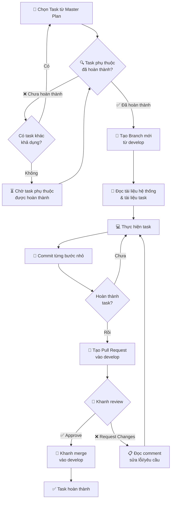
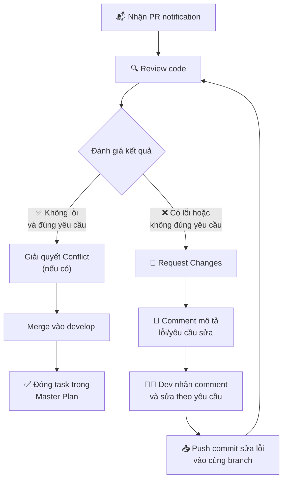
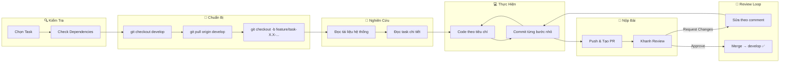

# 📘 Hướng Dẫn Quy Trình Thực Hiện Task — LizSwapSimple

> **Phiên bản:** v1 | **Ngày tạo:** 12 tháng 4 năm 2026 | **Tác giả:** Khanh  
---

## 📋 Mục Lục

1. [Tổng Quan Quy Trình](#1--tổng-quan-quy-trình)
2. [Bước 1 — Kiểm Tra Task Phụ Thuộc](#2--bước-1--kiểm-tra-task-phụ-thuộc)
3. [Bước 2 — Tạo Branch Mới](#3--bước-2--tạo-branch-mới)
4. [Bước 3 — Thực Hiện Task](#4--bước-3--thực-hiện-task)
5. [Bước 4 — Commit Theo Từng Bước Nhỏ](#5--bước-4--commit-theo-từng-bước-nhỏ)
6. [Bước 5 — Hoàn Thành & Tạo Pull Request](#6--bước-5--hoàn-thành--tạo-pull-request)
7. [Bước 6 — Code Review & Merge](#7--bước-6--code-review--merge)
8. [Prompt Gợi Ý Cho AI Agent](#8--prompt-gợi-ý-cho-ai-agent)
9. [Sơ Đồ Quy Trình Tổng Thể](#9--sơ-đồ-quy-trình-tổng-thể)

---

## 1. 🔄 Tổng Quan Quy Trình



---

## 2. 🔍 Bước 1 — Kiểm Tra Task Phụ Thuộc

Trước khi bắt đầu bất kỳ task nào, **BẮT BUỘC** kiểm tra cột **"Task phụ thuộc"** trong [master-plan.md](master-plan.md).

### Quy tắc:

| Tình huống | Hành động |
|---|---|
| Tất cả task phụ thuộc đã ✅ merged vào `develop` | ➡️ Tiến hành Bước 2 (tạo branch) |
| Có task phụ thuộc **chưa hoàn thành** | ➡️ Chuyển sang task khác **không bị block** |
| Không còn task nào khả dụng | ➡️ **Chờ** task phụ thuộc được hoàn thành, hoặc hỗ trợ review PR cho đồng đội |

### Ví dụ minh họa:

> Bạn muốn làm **Task 3.2 (Navbar Component)** → Kiểm tra cột phụ thuộc: `Task 3.1, Task 3.4`  
> - Task 3.1 đã merge ✅  
> - Task 3.4 **chưa merge** ❌  
> → **Không được bắt đầu Task 3.2.** Hãy chọn task khác hoặc chờ Huy hoàn thành Task 3.4.

> [!IMPORTANT]
> **Tuyệt đối KHÔNG bắt đầu code khi task phụ thuộc chưa được merge vào `develop`.** Điều này đảm bảo base code luôn ổn định và tránh conflict nghiêm trọng.

---

## 3. 🌿 Bước 2 — Tạo Branch Mới

Sau khi xác nhận task phụ thuộc đã hoàn thành, tạo branch mới **từ branch `develop`** (luôn luôn là `develop`, không phải `main`).

### Quy ước đặt tên branch:

```
feature/task-{WBS_ID}-{mo-ta-ngan}
```

### Ví dụ:

| WBS ID | Tên Branch |
|---|---|
| 1.1 | `feature/task-1.1-monorepo-init` |
| 2.4 | `feature/task-2.4-pair-amm` |
| 3.2 | `feature/task-3.2-navbar` |
| 4.2 | `feature/task-4.2-swap-page` |
| 5.1 | `feature/task-5.1-e2e-local` |

### Lệnh Git:

```bash
# 1. Đảm bảo develop đã cập nhật mới nhất
git checkout develop
git pull origin develop

# 2. Tạo branch mới từ develop
git checkout -b feature/task-{WBS_ID}-{mo-ta-ngan}

# Ví dụ cụ thể:
git checkout -b feature/task-2.1-contract-interfaces
```

> [!WARNING]
> **KHÔNG BAO GIỜ** tạo branch từ `main` hoặc từ branch feature khác. Branch cha **luôn là `develop`**.

---

## 4. 💻 Bước 3 — Thực Hiện Task

### 4.1. Đọc tài liệu TRƯỚC KHI code (Bắt buộc)

Trước khi viết bất kỳ dòng code nào, người thực hiện (hoặc AI Agent) **PHẢI** đọc và nắm rõ các tài liệu sau:

#### 📚 Tài liệu hệ thống (đọc mỗi lần bắt đầu task mới):

| # | File | Mục đích |
|---|---|---|
| 1 | `docs/srs.md` | Hiểu Use Cases `[UC]`, Functional Requirements `[FR]`, Non-Functional `[NFR]` |
| 2 | `docs/architecture/techstack.md` | Xác nhận công nghệ/thư viện được phép dùng |
| 3 | `docs/architecture/project-structure.md` | Đặt file đúng vị trí trong cây thư mục |
| 4 | `docs/architecture/c4-context.md` | Hiểu bối cảnh hệ thống |
| 5 | `docs/architecture/c4-container.md` | Hiểu container architecture |
| 6 | `docs/architecture/c4-component.md` | Hiểu component boundaries |
| 7 | `docs/architecture/frontend-design.md` | Quy chuẩn UI/UX (màu sắc, font, layout) |

#### 📝 Tài liệu task cụ thể:

| # | File | Mục đích |
|---|---|---|
| 1 | `docs/project-management/master-plan.md` | Xem tổng quan phase, dependencies |
| 2 | `docs/project-management/tasks/task-{WBS_ID}.md` | Chi tiết kỹ thuật, deliverables, tiêu chí hoàn thành |

### 4.2. Thực hiện code

- Code theo đúng **tiêu chí hoàn thành** ghi trong file task chi tiết.
- Tuân thủ **mã yêu cầu** (`[UC-XX]`, `[FR-XX]`, `[NFR-XX]`) đã liệt kê.
- Viết **comment truy vết** trong code ghi rõ đoạn code đang giải quyết cho requirement nào.

```typescript
// [FR-01.3] Công thức AMM x*y=k - Tính toán output amount
function getAmountOut(amountIn: bigint, reserveIn: bigint, reserveOut: bigint): bigint {
  // ...
}
```

---

## 5. 📝 Bước 4 — Commit Theo Từng Bước Nhỏ

> [!TIP]
> **Commit thường xuyên sau mỗi bước nhỏ hoàn thành.** Điều này giúp:
> - Dễ dàng **undo** nếu phát sinh lỗi
> - Lịch sử rõ ràng, dễ **truy vết** (trace)
> - Review PR thuận tiện hơn

### Quy tắc commit:

1. **Commit message bằng tiếng Việt**
2. **Mỗi commit = 1 đơn vị công việc nhỏ, hoàn chỉnh**
3. **Format commit message:**

```
[Task X.X] <Loại>: <Mô tả ngắn gọn>

<Mô tả chi tiết (nếu cần)>
```

### Các loại (Type) commit:

| Loại | Ý nghĩa | Ví dụ |
|---|---|---|
| `feat` | Thêm tính năng mới | `[Task 2.4] feat: Thêm hàm swap() trong LizSwapPair` |
| `fix` | Sửa lỗi | `[Task 2.4] fix: Sửa lỗi tính toán phí 0.3%` |
| `refactor` | Tái cấu trúc (không đổi logic) | `[Task 2.4] refactor: Tách logic mint ra helper riêng` |
| `test` | Thêm/sửa test | `[Task 2.9] test: Thêm unit test cho Factory.createPair` |
| `docs` | Cập nhật tài liệu | `[Task 5.5] docs: Cập nhật README hướng dẫn chạy Docker` |
| `chore` | Config, setup | `[Task 1.2] chore: Cấu hình Hardhat optimizer runs 200` |

### Ví dụ chuỗi commit cho Task 2.4 (LizSwapPair.sol):

```
[Task 2.4] feat: Tạo khung contract LizSwapPair kế thừa LizSwapERC20
[Task 2.4] feat: Thêm hàm mint() tính toán LP token cho provider
[Task 2.4] feat: Thêm hàm burn() xử lý trả lại token khi rút thanh khoản
[Task 2.4] feat: Thêm hàm swap() với công thức x*y=k và phí 0.3%
[Task 2.4] feat: Tích hợp ReentrancyGuard cho mint, burn, swap
[Task 2.4] refactor: Clean up code và thêm comment truy vết [FR-01.3]
```

### Lệnh Git:

```bash
# Stage các file liên quan
git add <files>

# Commit với message tiếng Việt
git commit -m "[Task 2.4] feat: Thêm hàm swap() với công thức AMM x*y=k"

# Push lên remote
git push origin feature/task-2.4-pair-amm
```

---

## 6. 🚀 Bước 5 — Hoàn Thành & Tạo Pull Request

Khi task đã hoàn thành tất cả tiêu chí, tạo **Pull Request (PR)** từ branch feature vào `develop`.

### Nội dung PR (bằng tiếng Việt):

```markdown
## 📌 Tiêu đề PR
[Task X.X] <Tên task từ Master Plan>

## 📝 Mô tả
### Tổng quan
<Mô tả ngắn gọn task đã làm gì>

### Thay đổi chính
- <Liệt kê các thay đổi chính theo bullet point>
- ...

### Mã yêu cầu liên quan
- `[UC-XX]`: <Mô tả>
- `[FR-XX]`: <Mô tả>

### Checklist
- [ ] Đã đọc tài liệu task chi tiết (`tasks/task-X.X.md`)
- [ ] Code đúng vị trí theo `project-structure.md`
- [ ] Đã test / compile thành công
- [ ] Comment truy vết mã yêu cầu trong code
- [ ] Không tự ý thêm dependency ngoài `techstack.md`
```

### Quy tắc PR:

| Quy tắc | Mô tả |
|---|---|
| **Target branch** | Luôn là `develop` |
| **Ngôn ngữ PR** | Tiếng Việt |
| **Reviewers** | Chỉ định **Khanh** làm reviewer |
| **Labels** | Gắn label Phase tương ứng (VD: `phase-2`, `smart-contract`) |

---

## 7. 🔎 Bước 6 — Code Review & Merge (do Khanh phụ trách)

### 7.1. Quy trình review của Khanh:



### 7.2. Tiêu chí Khanh duyệt PR:

| Tiêu chí | Mô tả |
|---|---|
| ✅ Đúng yêu cầu task | Code thực hiện đúng theo mô tả trong `tasks/task-X.X.md` |
| ✅ Đúng vị trí file | Tuân thủ `project-structure.md` |
| ✅ Đúng tech stack | Không dùng thư viện/phiên bản ngoài `techstack.md` |
| ✅ Có comment truy vết | Ghi rõ `[UC-XX]`, `[FR-XX]` trong code |
| ✅ Compile/build thành công | Code không có lỗi biên dịch |
| ✅ Test pass (nếu có) | Unit test chạy pass |
| ✅ Không break code hiện tại | Không gây regression |

### 7.3. Khi PR bị Request Changes:

1. **Dev đọc kỹ comment** Khanh để lại trên PR
2. **Sửa lỗi / điều chỉnh** theo yêu cầu
3. **Commit sửa lỗi** vào **cùng branch** (không tạo branch mới)
4. **Push** cập nhật — PR tự động cập nhật
5. **Nhắn Khanh review lại**
6. **Lặp lại** cho đến khi Khanh approve ✅

> [!CAUTION]
> **Không được tự merge PR.** Chỉ có **Khanh** (Trưởng dự án) mới có quyền merge vào `develop`. Khanh sẽ chịu trách nhiệm giải quyết conflict (nếu có) trước khi merge.

---

## 8. 🤖 Prompt Gợi Ý Cho AI Agent

Dưới đây là các prompt mẫu để sử dụng khi làm việc với AI Agent (Gemini, Claude, v.v.) trong từng giai đoạn:

---

### 📌 8.1. Bắt đầu task mới

```
Yêu cầu thực hiện Task {WBS_ID} — {Tên Task}.

Agent PHẢI đọc TẤT CẢ tài liệu liên quan trước khi bắt đầu:
- docs/srs.md
- docs/architecture/techstack.md
- docs/architecture/project-structure.md
- docs/architecture/c4-context.md, c4-container.md, c4-component.md
- docs/architecture/frontend-design.md
- docs/project-management/master-plan.md
- docs/project-management/tasks/task-{WBS_ID}.md

Kiểm tra task phụ thuộc đã hoàn thành chưa trước khi bắt đầu code.
Commit sau mỗi bước nhỏ hoàn thành, message bằng tiếng Việt.
```

---

### 📌 8.2. Sửa lỗi / Request Changes

```
PR Task {WBS_ID} bị Request Changes. Khanh comment:
"{Paste nội dung comment review}"

Agent PHẢI đọc TẤT CẢ tài liệu hệ thống để nắm rõ ngữ cảnh trước khi sửa lỗi:
- docs/srs.md
- docs/architecture/techstack.md
- docs/architecture/project-structure.md
- docs/architecture/frontend-design.md

Sau đó đọc lại file task chi tiết:
- docs/project-management/tasks/task-{WBS_ID}.md

Tiến hành sửa lỗi theo comment, commit riêng cho phần sửa lỗi.
```

---

### 📌 8.3. Hoàn thành task — Gợi ý commit & PR

```
Đã hoàn thành xong Task {WBS_ID} — {Tên Task}.

Gợi ý:
1. Commit summary và description bằng tiếng Việt cho lần commit cuối
2. Nội dung Pull Request bằng tiếng Việt bao gồm:
   - Tiêu đề PR
   - Mô tả tổng quan
   - Danh sách thay đổi chính
   - Mã yêu cầu liên quan ([UC-XX], [FR-XX])
   - Checklist hoàn thành
```

---

### 📌 8.4. Kiểm tra trạng thái dự án

```
Kiểm tra trạng thái hiện tại của dự án LizSwapSimple:
- Đọc master-plan.md để xem các task đã hoàn thành
- Liệt kê các task đang khả dụng (task phụ thuộc đã xong)
- Gợi ý task tiếp theo nên làm cho {Tên thành viên}
```

---

### 📌 8.5. Tạo branch và bắt đầu

```
Tạo branch mới cho Task {WBS_ID} theo quy trình:
1. Checkout develop và pull mới nhất
2. Tạo branch: feature/task-{WBS_ID}-{mo-ta-ngan}
3. Đọc file task chi tiết: docs/project-management/tasks/task-{WBS_ID}.md
4. Bắt đầu thực hiện, commit từng bước nhỏ
```

---

## 9. 📊 Sơ Đồ Quy Trình Tổng Thể



---

## 📎 Phụ Lục — Checklist Nhanh

Sử dụng checklist này cho mỗi task:

```markdown
### Checklist Task {WBS_ID}

**Trước khi code:**
- [ ] Kiểm tra task phụ thuộc đã merge vào develop
- [ ] Tạo branch từ develop (đã pull mới nhất)
- [ ] Đọc tài liệu hệ thống (srs, techstack, project-structure, frontend-design)
- [ ] Đọc file task chi tiết (tasks/task-{WBS_ID}.md)

**Trong khi code:**
- [ ] Code đúng vị trí theo project-structure.md
- [ ] Dùng đúng tech stack theo techstack.md
- [ ] Comment truy vết mã yêu cầu [UC-XX], [FR-XX]
- [ ] Commit sau mỗi bước nhỏ hoàn thành
- [ ] Commit message bằng tiếng Việt

**Sau khi code:**
- [ ] Compile/build thành công
- [ ] Test pass (nếu có)
- [ ] Push lên remote
- [ ] Tạo PR vào develop (nội dung tiếng Việt)
- [ ] Chỉ định Khanh làm reviewer
- [ ] Chờ Khanh review & merge
```

---

> **📌 Ghi nhớ quan trọng:** Quy trình này áp dụng cho **TẤT CẢ** thành viên (Khanh, Hộp, Huy) và **TẤT CẢ** task từ Phase 1 đến Phase 5. Mọi ngoại lệ đều phải được Khanh phê duyệt trước.
