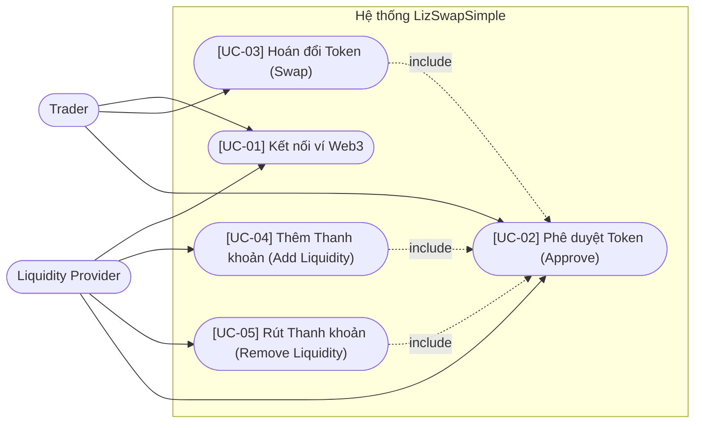

# Software Requirements Specification (SRS)

> **Phiên bản:** v1 | **Ngày tạo:** 9 tháng 4 năm 2026 | **Tác giả:** Khanh

## 1. Giới thiệu
**LizSwapSimple** là là sàn giao dịch phi tập trung (DEX) cung cấp trải nghiệm MVP tập trung vào các tính năng cốt lõi của giao thức AMM dựa trên kiến trúc Uniswap V2. Target framework cho blockchain là Binance Smart Chain (BSC).

## 2. Đối tượng Người dùng (Actors)
- **Người Giao Dịch (Trader)**: Sử dụng sàn để thực hiện hoán đổi (Swap) từ Token A sang Token B.
- **Người Cung Cấp Thanh Khoản (Liquidity Provider - LP)**: Nạp (Add) hoặc rút (Remove) tài sản vào hệ thống để cung cấp vốn cho Traders và nhận về một phần phí giao dịch.

### 2.1. Sơ Đồ Use Case Tổng Quan

## 3. Các Yêu Cầu Chức Năng (Functional Requirements - FR)

### [FR-01] Chức Năng Swap (Hoán đổi Token)
Tương ứng với [UC-03]
- **FR-01.1**: Người dùng kết nối ví tiêu chuẩn (như MetaMask) qua mạng BSC.
- **FR-01.2**: Người dùng chọn Token nguồn và Token đích để giao dịch.
- **FR-01.3**: Nhập số lượng và hệ thống hiển thị số lượng Token đầu ra ước tính dự kiến theo công thức Constant Product Formula (x * y = k).
- **FR-01.4**: Hiển thị các thông số tác động giao dịch như Price Impact, Minimum Received, và Slippage Tolerance.
- **FR-01.5**: Cho phép người dùng ký và gửi giao dịch lên on-chain.

### [FR-02] Cung Cấp Thanh Khoản (Add Liquidity)
Tương ứng với [UC-04]
- **FR-02.1**: Chọn một cặp Token muốn cung cấp thanh khoản.
- **FR-02.2**: Nhập số lượng của một Token, tự động quy đổi số lượng của Token thứ hai tương đương dựa trên tỷ giá của Pool hiện hành.
- **FR-02.3**: Approves sử dụng Token (nếu chưa có allowance) cho Router contract theo [UC-02].
- **FR-02.4**: Thực hiện giao dịch "Add Liquidity", người dùng sẽ nhận được LP Tokens đại diện cho phần của họ trên Pool tổng.

### [FR-03] Rút Thanh Khoản (Remove Liquidity)
Tương ứng với [UC-05]
- **FR-03.1**: Người dùng có thể xem danh sách Pool mà họ đã đóng góp thông qua số LP Tokens nắm giữ.
- **FR-03.2**: Cung cấp tính năng để đổi/chuyển (Remove) một lượng tương ứng LP Tokens thành Token A và Token B trả về ví của họ theo tỷ lệ tại thời điểm rút.
- **FR-03.3**: Yêu cầu phải Approved cho Router tiêu cháy lượng LP Token này theo [UC-02].

## 4. Các Yêu Cầu Phi Chức Năng (Non-Functional Requirements - NFR)

- **[NFR-01] Không Yêu Cầu Backend Database**: Hệ thống không lưu trữ bất kỳ trạng thái người dùng nào lên Database (nhóm RDBMS hay NoSQL truyền thống). Toàn bộ trạng thái và transaction lịch sử được truy xuất trực tiếp (Read/Write) thông qua RPC trực tiếp từ nodes BSC.
- **[NFR-02] Frontend Tĩnh Nhanh Chóng**: Giao diện website xây dựng theo định dạng "Web tĩnh". Đơn giản, dễ sử dụng cho người dùng MVP, có thể chạy và bundle qua một command Next.js trên Docker Compose lên production server hoặc cloud raw như S3/IPFS.
- **[NFR-03] Configurable**: Các thông số tuỳ chỉnh mạnh bằng ENV variables, đảm bảo khả năng deploy testnet sang mainnet không bị lỗi hardcode.
